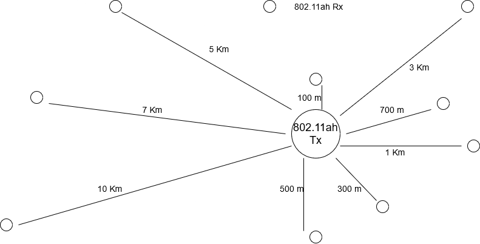
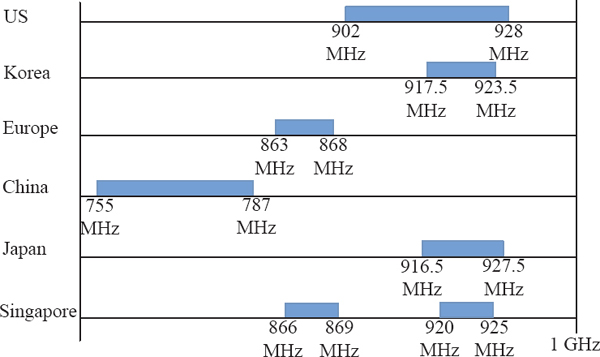
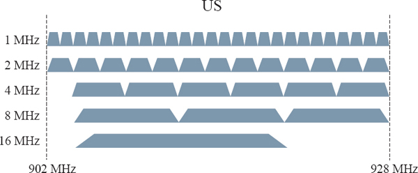

# 802.11ah HaLow simulation

**Proyecto TEL[315] Simulación de redes.** 

### Integrantes

* Marcelo Villablanca
* Christian Fuentes
* Mario Araya F.

### Avances

* Q function.
* SNR per bit.
* SER.
* PER.
* Friis Model.
* dB y dBm a veces(potencia).
* Discriminador de paquetes errados.
* Simulación completa.
* Gráficos.

### Descripción

En este proyecto se simulará un canal inalambrico que utilizará HaLow para transmitir por el medio.
El objetivo es determinar la tasa de transmisión efectiva o Goodput, dependiendo de factores como la distancia, entorno, entre otros.  

El siguiente diagrama representa una red sencilla con un nodo central el cual recibe de forma alámbrica información de distintas cámaras de seguridad, información que debe enviar de forma inalámbrica a distintos dispositivos a distintas distancias. 

A continuación se adjunta imagenes que muestran los anchos de banda utilizados por este estándar en los diferentes países desarrollados, 
además de el tamaño de los canales utilizados en la banda Estadounidense. 

### Enlaces a documentos

[Informe_Final](./Tel341_Simulación_de_transmisión_efectiva_para_WiFi_802.11ah_HaLow.pdf)  
[Modulo_HaLow](./docs/SX-NEWAH-ProductBrief_20200214-1815433.pdf)

